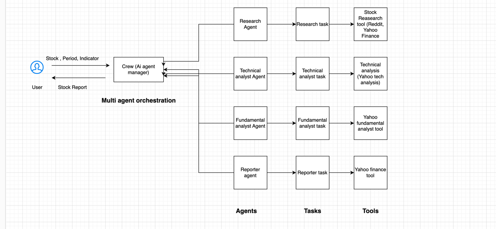

# Stock analysis chat AI bot using Multi Agent framework CrewAI and large language model OPENAI Gpt-4o-mini
An AI bot that can be use to do stocks technical and fundamental analysis

# Architectural Diagram


# Tech stack used
Python, CrewAI, OpenAI gpt-4o-mini LLM, Reddit, Yahoo finance

# get api key for openai

https://platform.openai.com/

# get Reddit key
https://www.reddit.com/prefs/apps

```add all api keys, client Id and client secret  in .env file```

# install cmd

```pip install -r requirements.txt```

# Application start cmd

```stremlit run app.py```

# Demo video
https://www.loom.com/share/3ce939b401f245aaaf5ab478fd3bed00?sid=014b8ad0-0edb-4cd5-b94d-db487cc2d9f4
